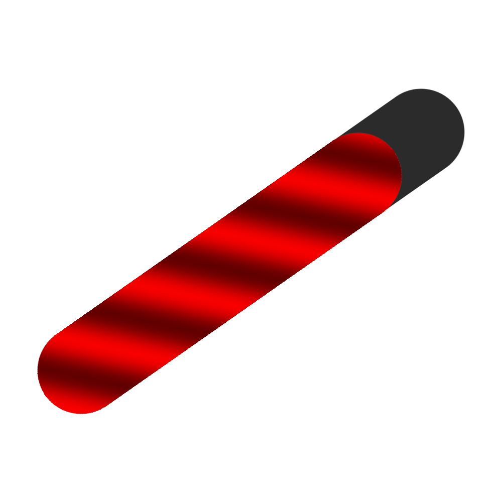
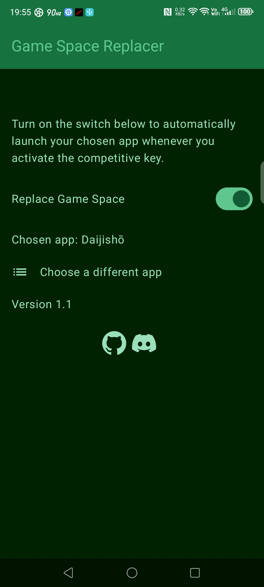
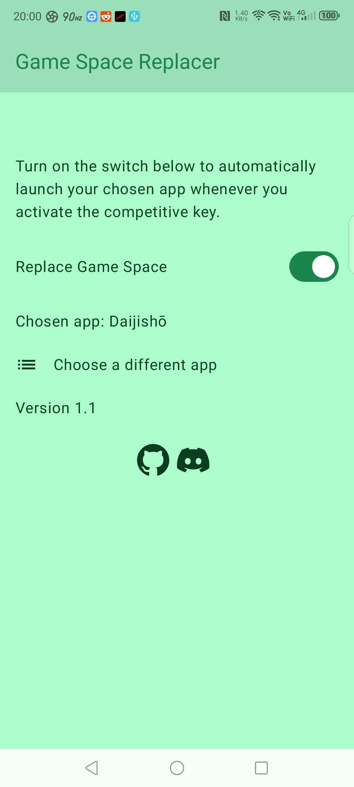

# Game Space Replacer

  
  
  

  

  Take control of the red switch on your REDMAGIC Android device!

## Description

**Game Space Replacer** is an Android app that allows you to customize the functionality of the red switch on your REDMAGIC device.

With this app, you can replace the default behavior of the red switch to launch your favorite game or app automatically when triggered.

## Features

- **Custom app selector**: Choose which app should launch when the red switch is pressed.
- **Minimal UI**: Clean, simple interface to manage the red switch functionality.
- **Privacy friendly**: Open source and no internet access, we don't store your data!

## Requirements

- Any Global modern REDMAGIC device running REDMAGIC OS.
- Necessary permissions:
  - Usage Stats Permission > Check if the Game Space has been launched.
  - Display over other apps permission > Launch a different app on top of the Game Space.
  - Notification access permission > Android requirement to keep the app running in the background.

## Tested Devices

The app supports most REDMAGIC devices, it has been tested from the 7 series up to the 11 series, but other models might work too.

It should work on any modern REDMAGIC device. If you encounter any issues, please feel free to open an issue on GitHub. 

> [!NOTE]  
> Chinese firmware isn't officially supported due to it's heavy background killing.

> [!WARNING]  
> Custom roms or GSIs aren't supported.
## Common Issues
- **On Android 15 or newer you must have set the switch to launch the Game Space.**

## Installation
- Go to the [Releases page](https://github.com/TheRealCrazyfuy/GameSpaceReplacer/releases) and download the latest release.
- Once the download is finished open the `.apk` and install it.
- Then just follow the instructions inside the app.
- **On Android 15+ you have to manually allow restricted permissions by going to Settings -> Apps -> Find Game Space Replacer -> press on the top 3 dots and allow them there**

## Contributions
All contributions are welcome, open a pull request and we'll look into it, thanks.

## Screenshots

## Community
Join our Discord community to connect directly with the project, share your feedback, and get the latest updates. Whether you need support or want to contribute, we’d love to have you with us!

